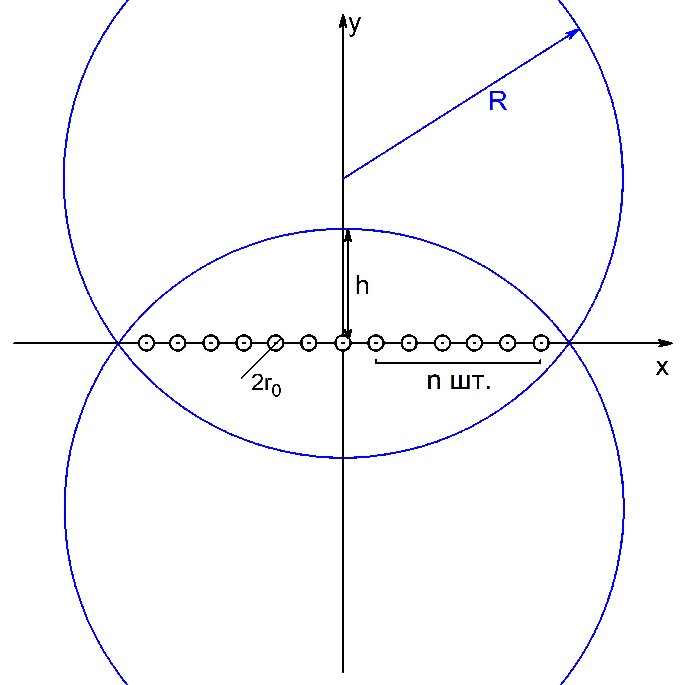

## Для создания полости в форме линзы (см. Рис.).


### Описание файлов

**create_cavity.txt** - шаблон входного файла. В нем нужно указать следующие параметры:

* **T0** температура жидкости
* **r_0** радиус малой полости, которая вырезается для размещения отталкивающих частиц
* **epsilon_2** параметр epsilon для второго типа частиц
* **sigma_2** начальный параметр sigma для центральной частицы второго типа 
* **sigma_2_max** максимальный параметр sigma для центральной частицы второго типа 
* **check_n_step** через сколько шагов проверять число частиц внутри полости
* **increase_sigma_step** через сколько шагов менять параметр sigma
* **N** число частиц жидкости

**rewrite_create_cavity.py** - python скрипт, который редактирует и создает стартовые файлы на основе create_cavity.txt. В нем нужно задать параметры:

* минимальное значение, максимальное значение, шаг изменения высоты линзы
```
h_start, h_stop, delta_h = 2, 2, 1
```
* минимальное значение, максимальное значение, шаг изменения радиуса сфер, образующих линзу
```
R_start, R_stop, delta_R = 3, 3, 1
```
* **n_copy** число копий систем при каждом заданном значении h и R

* **n** количество отталкивающих сфер с одной стороны от центральной сферы (см. Рис.)
* **input_file** шаблон входного файла (create_cavity.txt) 

### Запуск

Скопировать все файлы 
```
git clone https://github.com/itpuroran/cavitation_seeding_lense.git
```

Перед запуском нужно убедиться, что у вас есть папка dumpL, где лежат dump файлы метастабильной системы с именами dump_start_0.txt, dump_start_1.txt и т.д., момент времени ITEM: TIMESTEP в них должен быть 0. Количество файлов должно быть не меньше, чем число копий систем при каждом заданном значении h и R.

Пример "шапки" dump файла
```
ITEM: TIMESTEP
0
ITEM: NUMBER OF ATOMS
108000
ITEM: BOX BOUNDS pp pp pp
-9.2737654475012719e-03 5.1324818800015073e+01
-9.2737654475012719e-03 5.1324818800015073e+01
-9.2737654475012719e-03 5.1324818800015073e+01
ITEM: ATOMS id x y z vx vy vz
```

Запустить скрипт командой
```
python rewrite_create_cavity.py
```
Если программа завершится успешно, должны появиться папки create_cavity_files, dumps_twophase. В первой содержатся входные файлы для моделироваия, во вторую будут записываться результирующие dump файлы.

Запуск моделирования из этих файлов осуществялется скриптом start, где предварительно также нужно указать параметры h_start, h_stop, delta_h, R_start, R_stop, delta_R, n_copy.
```
./start
```
